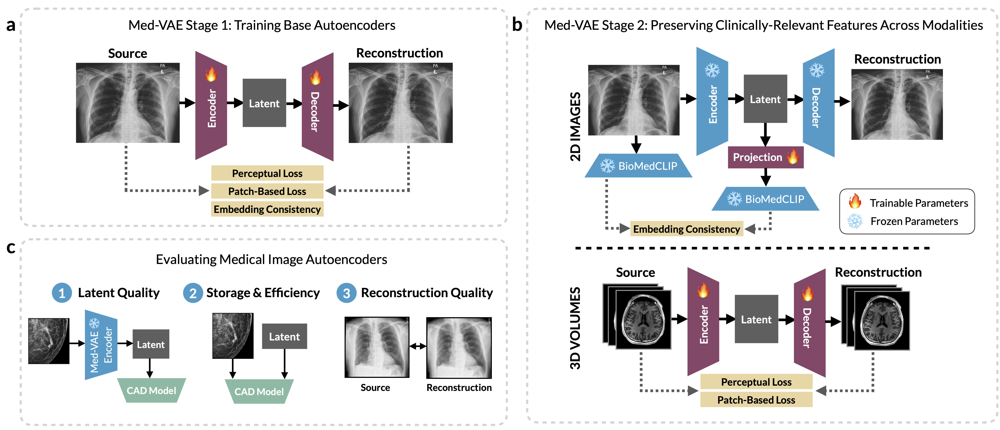

# MedVAE: Efficient Automated Interpretation of Medical Images with Large-Scale Generalizable Autoencoders
[](LICENSE)

This repository contains the official PyTorch implementation for MedVAE: Efficient Automated Interpretation of Medical Images with Large-Scale Generalizable Autoencoders.

[[🤗 Hugging Face](https://huggingface.co/ashwinkumargb/MedVAE)]



## 🫁 What is MedVAE?

MedVAE is a family of six large-scale, generalizable 2D and 3D variational autoencoders (VAEs) designed for medical imaging. It is trained on over one million medical images across multiple anatomical regions and modalities. MedVAE autoencoders encode medical images as downsized latent representations and decode latent representations back to high-resolution images. Across diverse tasks obtained from 20 medical image datasets, we demonstrate that utilizing MedVAE latent representations in place of high-resolution images when training downstream models can lead to efficiency benefits (up to 70x improvement in throughput) while simultaneously preserving clinically-relevant features.

## ⚡️ Installation
Use the following commands to clone and install this repository.
```python
git clone https://github.com/StanfordMIMI/MedVAE.git
cd medvae
pip install -e .
```

## 🚀 Usage Instruction

We allow for easy-to-use CLI inference tool for compressing your high-dimensional medical images into usable latents:

```python
medvae_inference -i INPUT_FOLDER -o OUTPUT_FOLDER -model_name MED_VAE_MODEL -modality MODALITY
```

## 📎 Citation
If you find this repository useful for your work, please cite the cite the original paper:

```bibtex
@article{varma2025medvae,
  title = {MedVAE: Efficient Automated Interpretation of Medical Images with Large-Scale Generalizable Autoencoders},
  author = {Maya Varma, Ashwin Kumar, Rogier van der Sluijs, Sophie Ostmeier, Louis Blankemeier, Pierre Chambon, Christian Bluethgen, Jip Prince, Curtis Langlotz, Akshay Chaudhari},
  year = {2025},
  publisher = {Github},
  journal = {Github},
  howpublished = {https://github.com/StanfordMIMI/MedVAE}
}
```

This repository is powered by [Hydra](https://github.com/facebookresearch/hydra) and [HuggingFace Accelerate](https://github.com/huggingface/accelerate). Our implementation of MedVAE is inspired by prior work on diffusion models from [CompVis](https://github.com/CompVis/latent-diffusion) and [Stability AI](https://github.com/Stability-AI/stablediffusion).